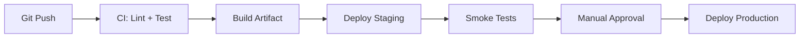

# Deployment Strategy

> **Template**: Copy to `feature-{name}.md` before editing. Run `/review-deployment` to validate.

**Related docs**: [Implementation](../implementation/) | [Testing](../testing/) | [Monitoring](../monitoring/)
**Applicable rules/skills**: `2-dotenv-environments` (env file structure), `cxl-security-review` (pre-deploy checklist), `cxl-create-pr` (PR workflow)

## Infrastructure
**Where will the application run?**

| Component | Service/Tool | Environment(s) | Notes |
|-----------|-------------|----------------|-------|
| Compute | [e.g., ECS, Lambda, VM] | dev/staging/prod | |
| Database | [e.g., RDS Postgres, DynamoDB] | dev/staging/prod | |
| Cache | [e.g., Redis, Memcached] | staging/prod | |
| CDN/Static | [e.g., CloudFront, S3] | prod | |
| Queue/Events | [e.g., SQS, Kafka] | staging/prod | |

- What cloud provider and region(s) are we using?
- How is infrastructure provisioned (Terraform, CDK, manual console)?
- What is the environment promotion path (dev -> staging -> prod)?

## Deployment Pipeline
**How do we deploy changes?**

Include a pipeline diagram for complex setups:



### Build Process
- What are the exact build commands?
  ```bash
  # Example:
  # npm run build
  # docker build -t app:$TAG .
  ```
- What asset compilation or optimization happens (minification, tree-shaking, image compression)?
- How are build artifacts versioned and stored?

### CI/CD Pipeline
- What CI system is used (GitHub Actions, GitLab CI, Jenkins)?
- What gates must pass before deployment (lint, unit tests, integration tests, security scan)?
- What is the deployment trigger (merge to main, tag, manual)?
- How long does a full pipeline run take?

## Environment Configuration (per `2-dotenv-environments` rule)
**What settings differ per environment?**

Follow the project's .env file structure:
```
.env.example      # All variables with placeholder values (committed)
.env              # Local overrides (gitignored)
.env.development  # Development defaults
.env.staging      # Staging environment
.env.production   # Production environment
```

| Variable / Setting | Development | Staging | Production | Source |
|-------------------|-------------|---------|------------|--------|
| `DATABASE_URL` | local Postgres | staging RDS | prod RDS | [env file / secrets manager] |
| `LOG_LEVEL` | debug | info | warn | env var |
| `FEATURE_FLAGS` | all on | matches prod | controlled | [flag service] |
| [Add more] | | | | |

- Are required environment variables validated at application startup?
- Where is the canonical env config stored (.env.example committed, production secrets in hosting platform)?
- What config changes require a redeploy vs dynamic reload?

## Deployment Steps
**What's the release process?**

### Pre-Deployment Checklist
- [ ] All CI checks passing on the deploy branch
- [ ] Database migrations tested on staging
- [ ] Feature flags configured for gradual rollout (if applicable)
- [ ] Stakeholders notified of deploy window
- [ ] Rollback plan reviewed

### Security Pre-Deployment (from `cxl-security-review`)
- [ ] No hardcoded secrets — all in env vars or secrets manager
- [ ] All user inputs validated with schemas
- [ ] All database queries parameterized
- [ ] Authentication: proper token handling (httpOnly cookies)
- [ ] Authorization: role checks in place
- [ ] Rate limiting enabled on all endpoints
- [ ] HTTPS enforced
- [ ] Security headers configured (CSP, X-Frame-Options)
- [ ] No sensitive data in error responses or logs
- [ ] Dependencies up to date, `npm audit` clean
- [ ] CORS properly configured

### Deploy Execution
1. [Step 1: e.g., Run migrations]
2. [Step 2: e.g., Deploy new version to staging]
3. [Step 3: e.g., Run smoke tests on staging]
4. [Step 4: e.g., Promote to production]
5. [Step 5: e.g., Verify production health checks]

### Post-Deployment Validation
- [ ] Health check endpoints returning 200
- [ ] Key user flows verified (manual or automated smoke tests)
- [ ] Error rates in monitoring are within normal range
- [ ] Performance metrics have not degraded

## Database Migrations
**How do we handle schema changes?**

- What migration tool is used (e.g., Prisma, Flyway, Alembic, raw SQL)?
- Are migrations run automatically during deploy or as a separate step?
- How do we handle backward compatibility (can old code run against new schema)?
- What is the backup procedure before destructive migrations?
- How long do migrations take on production data volumes?
- What is the rollback strategy (reverse migration, restore from backup)?

## Secrets Management
**How do we handle sensitive data?**

| Secret | Storage | Rotation frequency | Who has access |
|--------|---------|-------------------|----------------|
| Database credentials | [Vault / SSM / env] | [e.g., 90 days] | [roles] |
| API keys (third-party) | [storage] | [frequency] | [roles] |
| Encryption keys | [storage] | [frequency] | [roles] |

- How are secrets injected into the runtime (env vars, mounted files, SDK)?
- What happens when a secret is rotated (zero-downtime swap)?
- How do we audit secret access?

## Rollback Plan
**What if something goes wrong?**

| Trigger | Action | Expected downtime | Owner |
|---------|--------|------------------|-------|
| Error rate exceeds [X%] | [Revert deploy / feature flag off] | [minutes] | [Who] |
| Data corruption detected | [Restore from backup, halt writes] | [estimate] | [Who] |
| Dependent service down | [Enable fallback / circuit breaker] | [none / degraded] | [Who] |

- What is the exact rollback command or procedure?
- How do we handle rollback when database migrations have already run?
- Who needs to be notified during a rollback (team, stakeholders, users)?
- What is the post-rollback investigation process?

## Release Communication
**Who needs to know about deploys?**

- What changelog or release notes format do we use?
- Who is notified before, during, and after a deploy (Slack channel, email list)?
- How are user-facing changes communicated (in-app, docs, changelog)?
