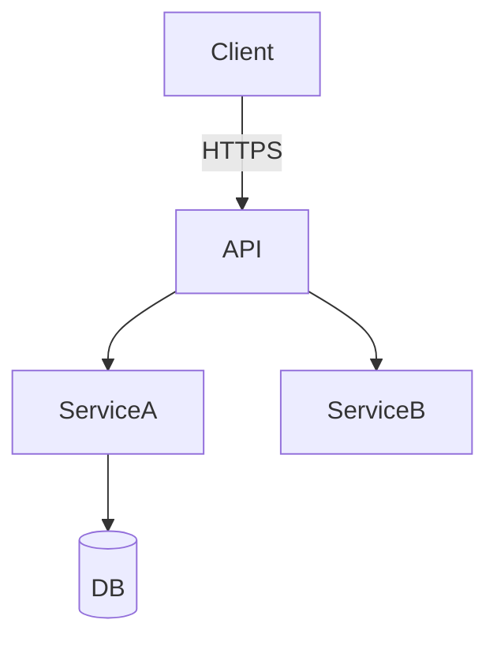
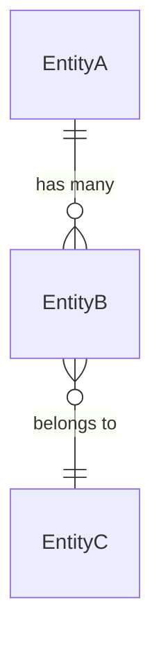

# System Design & Architecture

> **Template**: Copy to `feature-{name}.md` before editing. Run `/review-design` to validate.
>
> **Prerequisite**: The brainstorming skill (`cxl-brainstorming`) Understanding Lock (step 4) **must be confirmed** before writing this document. Brainstorming steps 5-7 (explore approaches, present design, decision log) produce the content for this template.

**Related docs**: [Requirements](../requirements/) | [Planning](../planning/) | [Implementation](../implementation/) | [Testing](../testing/)
**Applicable rules/skills**: `cxl-brainstorming` (steps 5-7), `cxl-security-review` (for security design)

## Architecture Overview
**What is the high-level system structure?**

Include a mermaid diagram that captures the main components and their relationships:

- What are the key components and what is each one responsible for?
- What technology stack are we using and why those choices over alternatives?
- What are the system boundaries (what's ours vs external)?

## Data Models
**What data do we need to manage?**

Define core entities and their relationships. Include an ER diagram for non-trivial models:

- What are the core entities, their fields, and types?
- What are the relationships and cardinalities between entities?
- How does data flow between components (input -> processing -> storage -> output)?
- What data needs to be migrated or seeded?

## API Design
**How do components communicate?**

Define contracts that the implementation and testing phases can verify against.

| Endpoint / Interface | Method | Auth | Request | Response | Notes |
|---------------------|--------|------|---------|----------|-------|
| [path or function] | [verb] | [required/public] | [key fields] | [shape + status codes] | |

- What authentication/authorization model are we using (API keys, JWT, OAuth, etc.)?
- What error response format will be consistent across all endpoints?
- What rate limits or quotas apply?
- Are there versioning requirements (URL path, headers)?

## Component Breakdown
**What are the major building blocks?**

| Component | Responsibility | Inputs | Outputs | Dependencies |
|-----------|---------------|--------|---------|-------------|
| [name] | [what it does] | [what it receives] | [what it produces] | [what it relies on] |

- Frontend components (if applicable): routing, state management, key UI modules
- Backend services/modules: business logic boundaries, shared libraries
- Database/storage layer: engine choice, indexing strategy, caching layer
- Third-party integrations: which services, what happens when they're down?

## Design Decisions (Decision Log)
**Why did we choose this approach?**

This section is the persistent form of the brainstorming Decision Log (step 7). Record every significant decision so future contributors understand the reasoning and don't revisit settled questions.

| Decision | Chosen approach | Alternatives considered | Trade-offs | Date |
|----------|----------------|----------------------|------------|------|
| [what was decided] | [what we picked] | [what else we evaluated] | [what we gave up] | [when] |

- What design patterns or principles are we applying (and where)?
- What constraints drove the decision (timeline, team expertise, existing infra)?
- Apply YAGNI ruthlessly: is each decision justified by a current need, not a speculative future one?

## Non-Functional Requirements
**What quality attributes must the system meet?**

| Attribute | Target | How to validate |
|-----------|--------|----------------|
| Latency | [e.g., p95 < 200ms] | [load test, APM] |
| Throughput | [e.g., 1000 rps] | [load test] |
| Availability | [e.g., 99.9%] | [uptime monitoring] |
| Data durability | [e.g., no data loss on crash] | [failover test] |

- What are the scalability requirements (users, data volume, geographic distribution)?
- What security requirements apply (encryption at rest/in-transit, audit logging, compliance)?
- What are the failure modes and how should the system degrade gracefully?

## Security Design
**What security considerations does this feature introduce?**

Reference the `cxl-security-review` skill for detailed checklists. At design time, address:

- What authentication/authorization changes are needed?
- What user input surfaces are introduced (and how will they be validated)?
- What sensitive data is handled (PII, tokens, credentials)?
- What new API endpoints need rate limiting?
- Are there OWASP Top 10 concerns relevant to this design?
- If applicable: row-level security, CSRF protection, CSP headers

## Open Design Questions
**What needs further investigation before implementation?**

- Unresolved technical questions (with owner if known)
- Spikes or prototypes needed to validate assumptions
- Areas where the design may change based on implementation learnings
