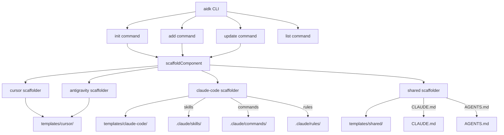

# System Design & Architecture — Claude Code Support

> **Prerequisite**: Brainstorming Understanding Lock confirmed. Requirements doc completed.

**Related docs**: [Requirements](../requirements/feature-claude-code-support.md) | [Planning](../planning/feature-claude-code-support.md) | [Implementation](../implementation/feature-claude-code-support.md) | [Testing](../testing/feature-claude-code-support.md)

## Architecture Overview

The design follows the **Parallel Scaffolder Pattern** — adding `claude-code` as a third scaffolder module alongside the existing `cursor.ts` and `antigravity.ts`.

**Key components:**
- `src/types.ts` — Extended with `'claude-code'` environment type
- `src/scaffolders/claude-code.ts` — New scaffolder for Claude Code directory mapping
- `src/registry/index.ts` — Environment-aware template scanning
- `src/utils/paths.ts` — New `claudeCodeTemplatesDir()` helper
- `templates/claude-code/` — Claude-Code-specific template files
- `templates/shared/CLAUDE.md` — Claude Code project memory template

## Data Models

No database or persistent data model changes. The existing `.ai-devkit.json` config structure is unchanged — it already supports `environments: string[]` which will now accept `'claude-code'`.

## API Design

N/A — this is a CLI tool, not a service.

## Component Breakdown

| Component | Responsibility | Inputs | Outputs | Dependencies |
|-----------|---------------|--------|---------|-------------|
| `src/types.ts` | Define `'claude-code'` environment type | None | Type definitions | None |
| `src/utils/paths.ts` | Resolve `templates/claude-code/` path | None | Absolute path string | Node `path` module |
| `src/scaffolders/claude-code.ts` | Map component types to `.claude/` directories, copy files | ComponentMeta, cwd | Files on disk | `fs-extra`, `paths.ts` |
| `src/scaffolders/index.ts` | Route to correct scaffolder per environment | Environment[], ComponentMeta | Delegated calls | All scaffolders |
| `src/scaffolders/shared.ts` | Scaffold `CLAUDE.md` alongside `AGENTS.md` | cwd, environments | Files on disk | `fs-extra`, `paths.ts` |
| `src/registry/index.ts` | Scan `templates/claude-code/` for components | None | ComponentMeta[] | `fs-extra`, `paths.ts` |
| `src/commands/init.ts` | Add 'Claude Code (.claude/)' to IDE selection | User input | Config + files | All above |
| `src/commands/update.ts` | Detect changes for claude-code target paths | Config | FileChange[] | `claude-code.ts` |
| `templates/claude-code/` | Claude-Code-specific template content | None | Source templates | None |
| `templates/shared/CLAUDE.md` | Claude Code project memory template | None | Template file | None |

## Design Decisions (Decision Log)

| Decision | Chosen approach | Alternatives considered | Trade-offs | Date |
|----------|----------------|----------------------|------------|------|
| Environment model | Full parity third environment | Minimal / Claude.md-only | More work but complete support | 2026-02-24 |
| Template strategy | Separate `templates/claude-code/` | Reuse cursor / Hybrid | Duplication but full control | 2026-02-24 |
| CLAUDE.md generation | Generate at project root | Skip / Generate both root + .claude/ | Simpler, consistent with AGENTS.md | 2026-02-24 |
| Registry architecture | Environment-aware scanning | Single registry | More flexible per-env resolution | 2026-02-24 |
| Design pattern | Parallel Scaffolder Pattern | Shared adapters / Plugin system | Follows YAGNI, proven pattern | 2026-02-24 |

## Non-Functional Requirements

| Attribute | Target | How to validate |
|-----------|--------|----------------|
| Backward compat | Zero breaking changes | Existing tests pass |
| Init speed | < 2s including claude-code | Manual timing |
| Template accuracy | All templates use correct Claude Code conventions | Content review |

## Security Design

No security-sensitive changes. Templates contain no secrets. No new authentication or authorization required.

## Open Design Questions

None — all resolved during brainstorming.
