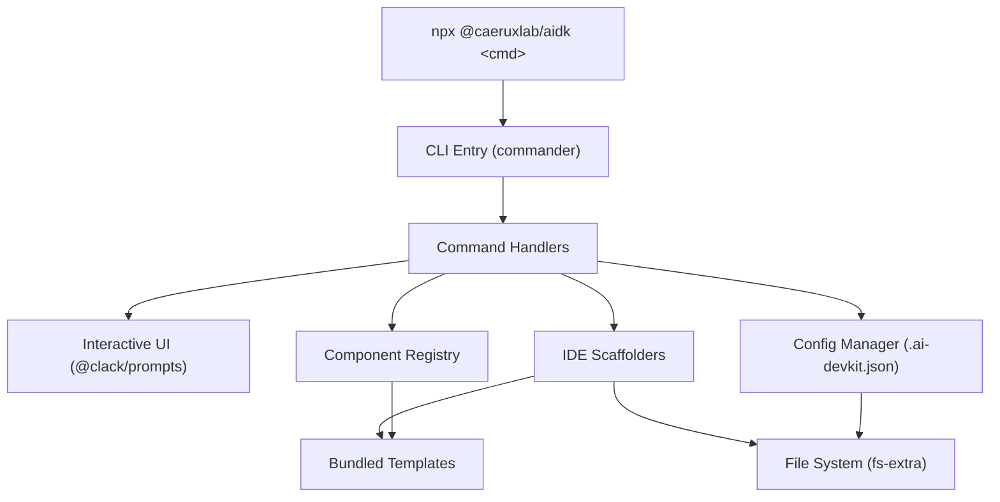

# System Design: CLI Tool (@caeruxlab/aidk)

**Related docs**: [Requirements](../requirements/feature-cli-tool.md) | [Planning](../planning/feature-cli-tool.md) | [Implementation](../implementation/feature-cli-tool.md) | [Testing](../testing/feature-cli-tool.md)

## Architecture Overview



**Key components:**

| Component | Responsibility |
|-----------|---------------|
| CLI Entry (`src/index.ts`) | Parse arguments, route to command handlers via Commander.js |
| Command Handlers (`src/commands/`) | Orchestrate prompts, validation, and scaffolding for each command |
| Interactive UI | User-facing prompts via @clack/prompts (select, multiselect, confirm) |
| Component Registry (`src/registry/`) | Catalog of all available components with metadata, resolved from `templates/` |
| IDE Scaffolders (`src/scaffolders/`) | Map templates to target paths per IDE, handle format conversion |
| Config Manager (`src/utils/config.ts`) | Read/write `.ai-devkit.json`, track installed state |
| File System utils (`src/utils/fs.ts`) | Safe file copy, remove, diff operations via fs-extra |
| Bundled Templates (`templates/`) | Ship as-is in npm package, not bundled into JS |

**Technology stack:**

| Layer | Choice | Why |
|-------|--------|-----|
| CLI framework | Commander.js | Lightweight, battle-tested, minimal overhead |
| Interactive UI | @clack/prompts | Beautiful terminal UX (used by Astro, SvelteKit) |
| File operations | fs-extra | Robust copy/remove with mkdirp |
| Colors | picocolors | Tiny, zero-dependency terminal colors |
| Build | tsup | Fast esbuild-based TS bundling |
| Test | Vitest | Fast, TypeScript-native |
| Runtime | Node.js >= 24 | Current LTS (v24.13.1) |

## Data Models

### `.ai-devkit.json` Schema

```json
{
  "version": "1.0.0",
  "cliVersion": "1.0.0",
  "environments": ["cursor", "antigravity"],
  "initializedPhases": [
    "requirements", "design", "planning",
    "implementation", "testing"
  ],
  "installedSkills": [
    "cxl-brainstorming", "cxl-coding-standards"
  ],
  "installedCommands": [
    "new-requirement", "execute-plan"
  ],
  "installedRules": [
    "0-force-rule", "3-coding-style"
  ]
}
```

| Field | Type | Description |
|-------|------|-------------|
| `version` | string | DevKit content version (tracks template changes) |
| `cliVersion` | string | CLI version that last modified this file |
| `environments` | string[] | Configured IDEs: `"cursor"`, `"antigravity"`, or both |
| `initializedPhases` | string[] | Doc phases scaffolded in `docs/ai/` |
| `installedSkills` | string[] | Skill names installed |
| `installedCommands` | string[] | Command/workflow names installed |
| `installedRules` | string[] | Rule names installed |

### Component Registry Entry

```typescript
interface ComponentMeta {
  name: string;
  description: string;
  type: ComponentType;
}

type ComponentType = 'skill' | 'command' | 'rule' | 'phase';
```

The registry is derived at build time by scanning `templates/` — no manual catalog.

## API Design

### CLI Commands

| Command | Arguments | Options | Description |
|---------|-----------|---------|-------------|
| `aidk init` | none | `--force` (overwrite existing) | Interactive full scaffolding |
| `aidk add <type> <name>` | type: skill\|command\|rule\|phase, name: component name | none | Add single component |
| `aidk remove <type> <name>` | type: skill\|command\|rule\|phase, name: component name | none | Remove single component |
| `aidk list [type]` | type (optional): skill\|command\|rule\|phase | none | List available/installed |
| `aidk update` | none | none | Update to latest with confirmation |

### Exit Codes

| Code | Meaning |
|------|---------|
| 0 | Success |
| 1 | General error (missing config, filesystem error) |
| 2 | User cancelled operation |

## Component Breakdown

### IDE Path Mapping

| Component Type | Template Source | Cursor Target | Antigravity Target |
|---|---|---|---|
| skill | `templates/cursor/skills/{name}/` | `.cursor/skills/{name}/` | `.agent/skills/{name}/` |
| command | `templates/cursor/commands/{name}.md` | `.cursor/commands/{name}.md` | `.agent/workflows/{name}.md` |
| rule | `templates/cursor/rules/{name}.mdc` | `.cursor/rules/{name}.mdc` | `.agent/rules/{name}.md` |
| phase | `templates/docs/{name}/README.md` | `docs/ai/{name}/README.md` | `docs/ai/{name}/README.md` |
| shared | `templates/shared/AGENTS.md` | `AGENTS.md` | `AGENTS.md` |

**Rule format conversion**: Cursor rules use `.mdc`, Antigravity uses `.md`. The CLI copies the file and changes the extension. Content is assumed identical.

### Source Code Structure

```
src/
├── index.ts                 # Entry point, Commander setup
├── commands/
│   ├── init.ts              # aidk init
│   ├── add.ts               # aidk add
│   ├── remove.ts            # aidk remove
│   ├── list.ts              # aidk list
│   └── update.ts            # aidk update
├── scaffolders/
│   ├── cursor.ts            # .cursor/ path resolution
│   ├── antigravity.ts       # .agent/ path resolution
│   └── shared.ts            # docs/ai/, AGENTS.md
├── registry/
│   └── index.ts             # Component catalog from templates/
└── utils/
    ├── config.ts            # .ai-devkit.json read/write
    ├── fs.ts                # File copy/remove/diff helpers
    └── prompts.ts           # Reusable prompt patterns
```

### Template Directory

```
templates/
├── cursor/
│   ├── commands/            # .md files (13 commands)
│   ├── rules/               # .mdc files (3 rules)
│   └── skills/              # Skill directories (15 skills)
├── docs/
│   ├── requirements/README.md
│   ├── design/README.md
│   ├── planning/README.md
│   ├── implementation/README.md
│   ├── testing/README.md
│   ├── deployment/README.md
│   └── monitoring/README.md
└── shared/
    └── AGENTS.md
```

Templates are stored once (Cursor format as canonical) and converted at scaffolding time for Antigravity.

## Design Decisions (Decision Log)

| # | Decision | Chosen | Alternatives | Trade-offs | Date |
|---|----------|--------|-------------|------------|------|
| 1 | CLI framework | Commander.js + @clack/prompts | oclif | Lightweight vs full framework; YAGNI on plugin system | 2026-02-23 |
| 2 | IDE detection | Prompt user to select | Auto-detect, flags | Explicit choice avoids wrong assumptions | 2026-02-23 |
| 3 | Distribution | GitLab Package Registry (`@caeruxlab/aidk`) | Public npm | Private fits personal/team use | 2026-02-23 |
| 4 | Template storage | Bundled in npm package | Remote registry, GitHub fetch | Simple, reliable, works offline | 2026-02-23 |
| 5 | Source location | Same repo (ai-dev-kit = CLI) | Monorepo, separate repo | Templates already here; simplest | 2026-02-23 |
| 6 | Build tool | tsup | tsc, rollup | Fast esbuild-based bundling | 2026-02-23 |
| 7 | Canonical template | Cursor format | Dual storage | Single source of truth, convert for Antigravity | 2026-02-23 |
| 8 | Update strategy | Diff + confirm per file | Auto-overwrite | User-requested safety; never overwrite without consent | 2026-02-23 |
| 9 | Registry generation | Build-time scan of templates/ | Manual catalog | Zero maintenance when adding templates | 2026-02-23 |
| 10 | Node.js version | >= 24 (LTS) | 18+, 20+, 22+ | Current LTS (v24.13.1 Krypton) | 2026-02-23 |

## Non-Functional Requirements

| Attribute | Target | How to validate |
|-----------|--------|----------------|
| Command latency | < 2s for typical operations | Manual timing |
| Package size | < 5MB (templates are markdown) | `npm pack --dry-run` |
| Zero network | No runtime network calls | Code review |
| Error messages | Human-readable, actionable | Manual review |

## Security Design

- No authentication or user input beyond CLI args and interactive prompts
- No network calls at runtime (all templates bundled)
- No sensitive data handled (templates are markdown/config files)
- Package published to GitLab Package Registry with scope restriction
- `.npmrc` configuration required to install from GitLab Package Registry

## Open Design Questions

- Are there `.mdc`-specific frontmatter fields that need stripping for `.md` conversion?
- Should `aidk init` generate a `.npmrc` file to help configure GitLab Package Registry for downstream projects?
