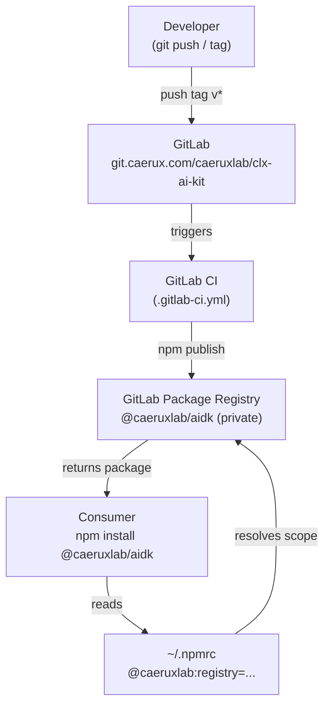

# System Design: GitHub → GitLab Migration

**Related docs**: [Requirements](../requirements/feature-github-to-gitlab.md) | [Planning](../planning/feature-github-to-gitlab.md) | [Implementation](../implementation/feature-github-to-gitlab.md) | [Testing](../testing/feature-github-to-gitlab.md)

## Architecture Overview

The post-migration distribution architecture replaces GitHub Packages with GitLab's project-level Package Registry. No changes to the CLI execution model.



**Key components:**

| Component | Before (GitHub) | After (GitLab) |
|-----------|----------------|----------------|
| Source repository | `github.com/anhvt2280/ai-dev-kit` | `git.caerux.com/caeruxlab/clx-ai-kit` |
| npm scope | `@anhvt2280` | `@caeruxlab` |
| npm registry | `https://npm.pkg.github.com` | `https://git.caerux.com/api/v4/projects/caeruxlab%2Fclx-ai-kit/packages/npm/` |
| CI/CD | `.github/workflows/publish.yml` (GitHub Actions) | `.gitlab-ci.yml` (GitLab CI) |
| Auth token type | GitHub PAT (`write:packages`) | GitLab PAT (`write_package_registry`) or CI Job Token |
| Release trigger | GitHub Release UI | GitLab tag push (`v*`) |

## Data Models

No data model changes. The `.ai-devkit.json` schema and all template files are unchanged.

The only "data" changes are configuration values across multiple files:

| File | Field | Old value | New value |
|------|-------|-----------|-----------|
| `package.json` | `name` | `@anhvt2280/aidk` | `@caeruxlab/aidk` |
| `package.json` | `publishConfig.registry` | `https://npm.pkg.github.com` | `https://git.caerux.com/api/v4/projects/caeruxlab%2Fclx-ai-kit/packages/npm/` |
| `package.json` | `repository.url` | `https://github.com/anhvt2280/ai-dev-kit.git` | `https://git.caerux.com/caeruxlab/clx-ai-kit.git` |

## API Design

### GitLab Package Registry — npm endpoint

| Endpoint | Method | Auth | Description |
|----------|--------|------|-------------|
| `GET /api/v4/projects/:id/packages/npm/@caeruxlab/aidk` | GET | PAT `read_package_registry` | Resolve package metadata |
| `PUT /api/v4/projects/:id/packages/npm/@caeruxlab%2Faidk` | PUT | PAT `write_package_registry` or CI Job Token | Publish package |

The project ID can be encoded as the URL-encoded path: `caeruxlab%2Fclx-ai-kit`.

### `.npmrc` Configuration (consumer)

```
@caeruxlab:registry=https://git.caerux.com/api/v4/projects/caeruxlab%2Fclx-ai-kit/packages/npm/
//git.caerux.com/api/v4/projects/caeruxlab%2Fclx-ai-kit/packages/npm/:_authToken=YOUR_GITLAB_TOKEN
```

### `.npmrc` Configuration (CI — automatic via CI Job Token)

```
@caeruxlab:registry=https://git.caerux.com/api/v4/projects/${CI_PROJECT_ID}/packages/npm/
//git.caerux.com/api/v4/projects/${CI_PROJECT_ID}/packages/npm/:_authToken=${CI_JOB_TOKEN}
```

## Component Breakdown

### `.gitlab-ci.yml` Pipeline Design

The pipeline replaces `.github/workflows/publish.yml`. It runs only on `v*` tag pushes.

```yaml
# High-level structure (full implementation in implementation doc)
stages:
  - test
  - publish

test:
  stage: test
  script:
    - npm ci
    - npm run lint
    - npm test

publish:
  stage: publish
  rules:
    - if: '$CI_COMMIT_TAG =~ /^v/'
  script:
    - npm ci
    - npm run build
    - npm publish
```

The pipeline uses `$CI_JOB_TOKEN` — zero-config, no secrets to manage.

### Files Changed

| File | Change type | Description |
|------|------------|-------------|
| `package.json` | Update | scope, publishConfig, repository |
| `README.md` | Rewrite install section | GitLab registry URL, GitLab PAT instructions |
| `PUBLISHING.md` | Full rewrite | GitLab-based workflow end-to-end |
| `.gitlab-ci.yml` | New file | Replaces `.github/workflows/publish.yml` |
| `docs/ai/requirements/feature-cli-tool.md` | Update | Replace GitHub Packages references |
| `docs/ai/design/feature-cli-tool.md` | Update | Decision #3: distribution → GitLab Packages |
| `docs/ai/implementation/feature-cli-tool.md` | Update | Clone URL, npmrc, publish steps |

## Design Decisions (Decision Log)

| # | Decision | Chosen | Alternatives | Trade-offs | Date |
|---|----------|--------|-------------|------------|------|
| 1 | npm scope | `@caeruxlab` | Keep `@anhvt2280` | Aligns with GitLab group; breaks existing installs for any prior consumers | 2026-02-23 |
| 2 | Registry level | Project-level (`/caeruxlab/clx-ai-kit`) | Group-level (`/caeruxlab`) | Simpler for a single-package project; group-level would require group-level tokens | 2026-02-23 |
| 3 | CI auth | CI Job Token (`$CI_JOB_TOKEN`) | GitLab Deploy Token, PAT stored as CI variable | Job Token is zero-config in GitLab CI; no manual secret management | 2026-02-23 |
| 4 | Release trigger | Tag push (`v*` regex rule) | GitLab Release UI, manual pipeline trigger | Tag push is the simplest; aligns with `npm version` workflow | 2026-02-23 |
| 5 | Migration scope | Infra + docs only; no CLI logic changes | Full rewrite | YAGNI — CLI functionality is unchanged | 2026-02-23 |
| 6 | Old GitHub repo | Leave in place, add deprecation notice if needed | Delete | Safe; avoids breaking anything in flight | 2026-02-23 |

## Non-Functional Requirements

| Attribute | Target | How to validate |
|-----------|--------|----------------|
| Pipeline runtime | < 3 minutes for test + publish | GitLab CI pipeline duration |
| Package install time | < 5 seconds (no network calls at runtime) | Manual timing |
| Zero secrets in repo | No tokens committed | grep for token patterns; CI audit |
| Registry auth | Only GitLab PAT or CI Job Token | PUBLISHING.md documents no other method |

## Security Design

- **No credentials in the repository**: `.npmrc` with real tokens is always in `~/.npmrc` (global, gitignored) or injected as CI environment variables
- **CI Job Token scoping**: GitLab automatically limits `$CI_JOB_TOKEN` to the project's own registry — no cross-project token leakage
- **Private package**: `@caeruxlab/aidk` is private; requires authentication to install. Consumers must have a GitLab PAT with `read_package_registry` scope
- **No runtime network calls**: CLI never calls GitLab at runtime — distribution-only concern
- **Token rotation**: GitLab PATs have configurable expiry; document rotation in PUBLISHING.md

## Open Design Questions

- Should a group-level registry URL be used if additional packages are added to `caeruxlab` in the future? *(Revisit if group grows beyond this package)*
- Should `aidk init` optionally generate a `.npmrc` snippet for the GitLab registry to help bootstrap new projects? *(Deferred to a future feature)*
- Is a GitLab Release (tag + release notes UI) needed, or is a tag push alone sufficient? *(Tag push is sufficient for now — can add release creation step in CI later)*
