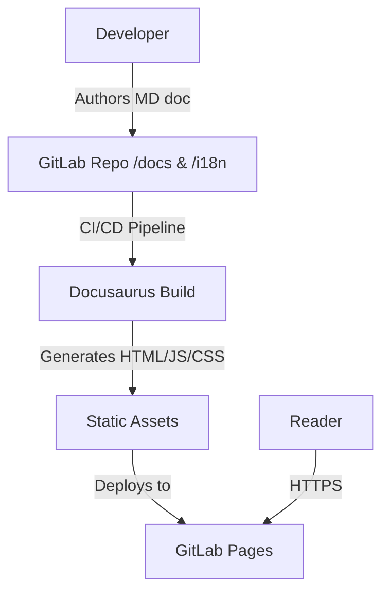

# System Design & Architecture

**Related docs**: [Requirements](../requirements/feature-project-documentation.md) | [Planning](../planning/feature-project-documentation.md) | [Implementation](../implementation/feature-project-documentation.md) | [Testing](../testing/feature-project-documentation.md)
**Applicable rules/skills**: `cxl-docusaurus-setup`

## Architecture Overview
**What is the high-level system structure?**

The documentation site will be an independent, statically-generated site utilizing Docusaurus v3, co-located in the main repository within the `website/` folder.



## Component Breakdown
**What are the major building blocks?**

| Component | Responsibility | Inputs | Outputs | Dependencies |
|-----------|---------------|--------|---------|--------------|
| **Docusaurus Core** | Scaffolds the site, handles routing, layout, and styling. | Markdown files, `docusaurus.config.ts`, `sidebars.ts` | HTML/JS/CSS static assets | React, Node.js |
| **i18n Module** | Provides language routing (`/` for VI, `/en` for EN, `/ja` for JA) and loads locale translations. | `i18n/{locale}/` JSON & MD files | Locale-specific rendered pages | Docusaurus i18n system |
| **Search Plugin** | Generates a local search index at build time and provides client-side search UI. | All Markdown content | `search-index.json`, search UI component | `@easyops-cn/docusaurus-search-local` |
| **GitLab CI Pipeline** | Builds and deploys the static site automatically on push to `main`. | Repo source, `NPM_TOKEN` CI variable | `public/` artifact → GitLab Pages | GitLab Runner, Node.js image |

## Data Models & Content Structure
No database is used. The "data" consists of Markdown (`.md` or `.mdx`) files following this structure:

```
website/
├── docs/                     # Default locale (Vietnamese)
│   ├── intro.md
│   ├── setup.md
│   ├── cli-usage.md
│   ├── internals.md
│   ├── examples.md
│   ├── publishing.md
│   ├── gitlab-setup.md
│   ├── rules-skills.md
│   └── docusaurus-guide.md
├── i18n/
│   ├── en/
│   │   ├── docusaurus-plugin-content-docs/
│   │   │   ├── current/              # EN Markdown translations
│   │   │   └── current.json          # EN sidebar category/doc label translations
│   │   └── docusaurus-theme-classic/
│   │       └── navbar.json           # EN navbar label translations
│   └── ja/
│       ├── docusaurus-plugin-content-docs/
│       │   ├── current/              # JA Markdown translations
│       │   └── current.json          # JA sidebar category/doc label translations
│       └── docusaurus-theme-classic/
│           └── navbar.json           # JA navbar label translations
├── sidebars.ts               # Explicit sidebar structure
└── docusaurus.config.ts
```

> **Sidebar strategy**: Sidebar items are explicitly declared in `sidebars.ts` and ordered via `sidebar_position` frontmatter. Category label translations use the key pattern `sidebar.{sidebarId}.category.{label}` and doc item labels use `sidebar.{sidebarId}.doc.{label}` in `current.json`.
>
> **Translation key discovery**: Always run `npm run docusaurus write-translations -- --locale {locale}` to generate correct key scaffolding before filling translations in manually.

## Design Decisions (Decision Log)

| Decision | Chosen approach | Alternatives considered | Trade-offs | Date |
|----------|----------------|----------------------|------------|------|
| **Directory Strategy** | A standalone `website/` directory next to the CLI packages. | Monorepo structure (`npm workspaces`). | Simplest implementation. Avoids touching existing CLI build processes (YAGNI). Limits direct code-sharing, but this is a docs site. | 2026-02-23 |
| **Tech Stack** | Docusaurus v3 | Next.js with MDX, VuePress | Docusaurus is purpose-built for docs with out-of-the-box i18n and local search support. | 2026-02-23 |
| **Search Solution** | `@easyops-cn/docusaurus-search-local` | Algolia DocSearch | Since it is an internal/CLI tool site, a local index avoids needing Algolia API keys and external indexer dependencies. | 2026-02-23 |
| **Primary Locale** | `vi` (Vietnamese) | `en` (English) | The `cxl-docusaurus-setup` skill enforces a Vietnamese-first workflow for this specific project environment. | 2026-02-23 |

## Non-Functional Requirements

| Attribute | Target | How to validate |
|-----------|--------|-----------------|
| Availability | High uptime — inherited from GitLab Pages SLA | GitLab Pages hosting metrics |
| Client Performance | Google Lighthouse score > 90 on Desktop | Manual Lighthouse audit after deployment |
| Latency | N/A — static files; CDN edge serving handles latency | — |
| Throughput | N/A — static CDN; GitLab Pages scales automatically | — |
| Data Durability | N/A — no database; source of truth is the Git repository | — |

## API Design
_Not applicable: this is a statically-generated documentation site with no server-side API. All content is served as pre-rendered HTML/JS/CSS via GitLab Pages._

## Security Design
**What security considerations does this feature introduce?**

This is a **public static site** with no user authentication, no database, and no server-side logic. Security surface is minimal:

| Concern | Detail |
|---------|--------|
| **Secrets in build artifacts** | No secrets or tokens should appear in generated HTML/JS. The `NPM_TOKEN` CI variable must be `Protected` + `Masked` in GitLab CI settings. |
| **HTTPS** | Enforced automatically by GitLab Pages — no configuration required. |
| **User input** | The only user input is the search query, processed entirely client-side by the local search plugin. No server-side validation needed. |
| **Dependency supply chain** | `@easyops-cn/docusaurus-search-local` and Docusaurus itself are open-source npm packages. Pin versions in `package.json` and review on upgrade. |
| **OWASP Top 10** | No relevant concerns for a static site with no auth, sessions, or server-side processing. |

_Reference_: `cxl-security-review` skill is not applicable for this feature given the static nature of the site.

## Open Design Questions
- **[Open]** Who owns ongoing translation maintenance (EN/JA) when new pages are added? A defined process (e.g., contributor checklist, CI lint for missing translations) should be established before the first public release. (Cross-reference: Requirements open item.)
