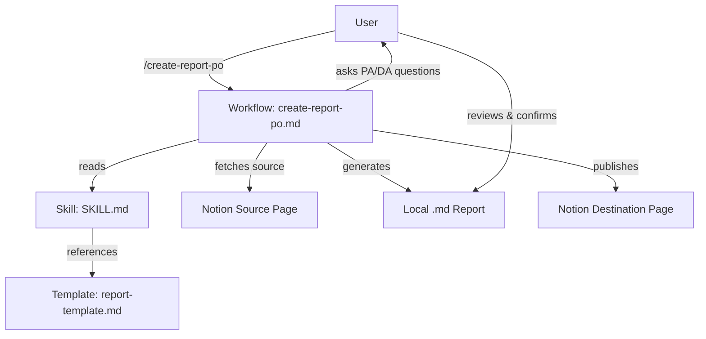

# Design: PA/DA Report Generator (`report-po`)

> **Status**: ✅ Complete
>
> **Related docs**: [Requirements](../requirements/feature-report-po.md) | [Planning](../planning/feature-report-po.md) | [Implementation](../implementation/feature-report-po.md) | [Testing](../testing/feature-report-po.md)

## Architecture Overview

This feature consists of AI agent configuration files (skill + workflow), not a running service.

**Components:**
- **Workflow** (`create-report-po.md`): 12-step process orchestrating the full report lifecycle
- **Skill** (`SKILL.md`): PA/DA methodology, AI behavior rules, question flow
- **Template** (`report-template.md`): Reusable Vietnamese report structure

## Data Models

No persistent data models — reports are generated as Markdown files and Notion pages.

**Report structure:**
- Metadata: date, reporter, project, source link
- PA section: What / Where / When / Extent / Root cause
- DA section: Options list / Comparison table / Recommendation
- Conclusion

## Component Breakdown

| Component | Responsibility | Inputs | Outputs | Dependencies |
|-----------|---------------|--------|---------|-------------|
| `SKILL.md` | Define PA/DA methodology, AI rules | N/A (configuration) | N/A | None |
| `report-template.md` | Provide report structure | N/A (template) | N/A | None |
| `create-report-po.md` | Orchestrate report creation | User answers, Notion source page | Local .md file, Notion page | Notion MCP, Skill, Template |

## Design Decisions (Decision Log)

| Decision | Chosen approach | Alternatives considered | Trade-offs | Date |
|----------|----------------|----------------------|------------|------|
| File structure | Skill + separate template + workflow | All-in-one SKILL.md | More files, but better separation of concerns | 2026-02-24 |
| Report language | Always Vietnamese | Multilingual | Less flexible, but matches team needs | 2026-02-24 |
| Report sections | Always PA + DA | Optional DA | Always complete reports, even when DA seems unnecessary | 2026-02-24 |
| Notion destination | Ask each time | Fixed database | More flexible for different teams/projects | 2026-02-24 |
| Review step | Local .md before Notion publish | Direct publish | Extra step, but prevents mistakes | 2026-02-24 |
| Question style | One at a time with suggestions | Batch questions | Slower but higher quality answers | 2026-02-24 |
| File naming | `report-pa-da-{date}-{title}.md` | UUID-based | Human-readable and sortable | 2026-02-24 |

## Non-Functional Requirements

| Attribute | Target | How to validate |
|-----------|--------|----------------|
| Usability | Any team member can use without training | Follow the workflow steps |
| Consistency | All reports same structure | Compare against template |
| Reliability | Works even if Notion MCP fails | Local .md fallback |

## Security Design

- No secrets or credentials handled by this feature
- Reports may contain sensitive project information — handled by Notion workspace permissions
- No new API endpoints introduced

## Open Design Questions

- None — all resolved during brainstorming
