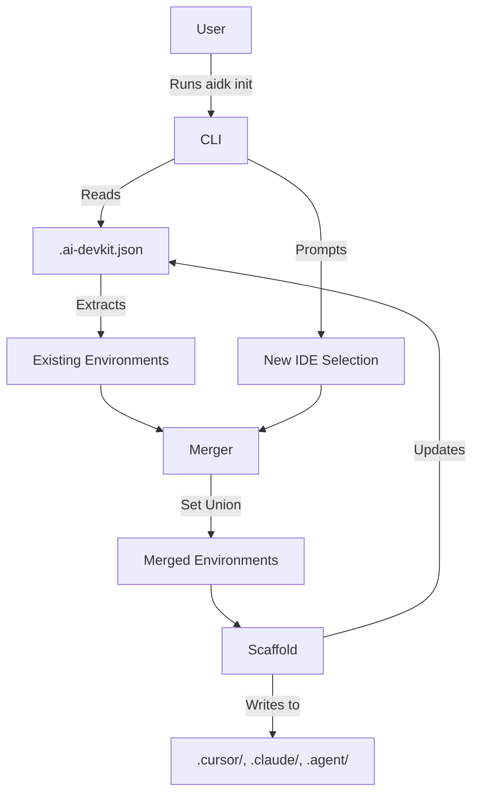

# System Design & Architecture

**Related docs**: [Requirements](../requirements/feature-support-multiple-ides.md) | [Planning](../planning/feature-support-multiple-ides.md) | [Implementation](../implementation/feature-support-multiple-ides.md) | [Testing](../testing/feature-support-multiple-ides.md)

## Architecture Overview
**What is the high-level system structure?**

The system enhances the existing CLI initialization flow (`initCommand`) to read the existing `.ai-devkit.json` configuration, extract previous IDE environments, and merge them with newly selected ones using a set union.



- **Key Components**: `initCommand` coordinates the prompt structure and merges the configuration arrays safely. Configuration utilities ensure the `ai-devkit.json` state isn't overwritten improperly.
- **System boundary**: Strictly bounded to the internal scaffolding and configuration reading mechanics of `aidk`.

## Data Models
We are primarily managing the `Environment` array schema stored in `.ai-devkit.json`.
- The `environments` property expects an array of strings: `['cursor', 'claude-code', 'antigravity']`.
- No new entities are introduced; we are enhancing the handling of the existing `environments` array to preserve historic data.

## API Design
No new external APIs are introduced. 
The internal CLI interface for `@clack/prompts` is updated to set `initialValues` based on the existing `environments` array:
```typescript
initialValues: existing?.environments ? (existing.environments as Environment[]) : undefined
```

## Component Breakdown

| Component | Responsibility | Inputs | Outputs | Dependencies |
|-----------|---------------|--------|---------|-------------|
| `initCommand` | Handles CLI initialization and prompt interactions | Existing config, User multi-select | Merged environment array | `@clack/prompts`, Config Utilities |
| Configuration Merger | Safely combines historic and new environments | `existing.environments`, `envSelection` | Duplicate-free array of `Environment` | None |

## Design Decisions (Decision Log)

| Decision | Chosen approach | Alternatives considered | Trade-offs | Date |
|----------|----------------|----------------------|------------|------|
| Merging logic | Set union `[...new Set([...existing, ...selected])]` | Prompting user to manually add/remove existing ones | Simple and robust. Prevents accidental deletion of existing configs if the user forgets to re-select them. | Current |
| Prompt default values | Pre-populate the multi-select with existing configurations | Blank prompt every time | Provides better UX by showing the current state of the project. | Current |

## Non-Functional Requirements

| Attribute | Target | How to validate |
|-----------|--------|----------------|
| Preservation | Existing configs must not be lost | Running `init` and picking a new IDE retains old `environments` |
| Performance | No noticeable slowdown | Array manipulation (O(n) where n <= 3) is instant |

## Security Design
No particular security implications. It only modifies local configuration items.

## Open Design Questions
None. The design is fully validated.
