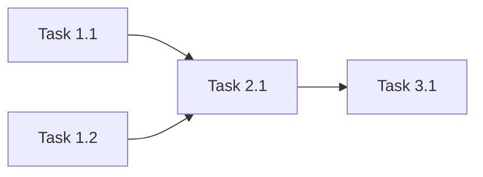

# Project Planning & Task Breakdown

> **Template**: Copy to `feature-{name}.md` before editing. Run `/execute-plan` to work through tasks or `/update-planning` to reconcile progress.
>
> **Prerequisite**: Requirements and design docs should be completed and reviewed before planning. The brainstorming Decision Log and design doc inform task breakdown.

**Related docs**: [Requirements](../requirements/) | [Design](../design/) | [Implementation](../implementation/) | [Testing](../testing/)
**Applicable rules/skills**: `3-coding-style` (quality checklist), `cxl-create-pr` (PR workflow)

## Milestones
**What are the major checkpoints?**

Each milestone should represent a shippable or demo-able increment.

| Milestone | Description | Target date | Exit criteria |
|-----------|-------------|-------------|---------------|
| M1 | [Description] | [Date] | [What must be true to call it done] |
| M2 | [Description] | [Date] | [What must be true] |
| M3 | [Description] | [Date] | [What must be true] |

## Task Breakdown
**What specific work needs to be done?**

Break tasks small enough that each can be completed in a single session. Reference design doc sections where applicable.

### Phase 1: Foundation
- [ ] Task 1.1: [Description] — Est: [hours/points] — Depends on: [none / task ID]
- [ ] Task 1.2: [Description] — Est: [hours/points] — Depends on: [task ID]

### Phase 2: Core Features
- [ ] Task 2.1: [Description] — Est: [hours/points] — Depends on: [task ID]
- [ ] Task 2.2: [Description] — Est: [hours/points] — Depends on: [task ID]

### Phase 3: Integration & Polish
- [ ] Task 3.1: [Description] — Est: [hours/points] — Depends on: [task ID]
- [ ] Task 3.2: [Description] — Est: [hours/points] — Depends on: [task ID]

## Dependencies
**What needs to happen in what order?**

Include a dependency diagram for non-trivial task graphs:

- Which tasks block other tasks?
- What external dependencies exist (APIs, services, third-party approvals)?
- Are there cross-team handoffs or review gates?

## Timeline & Estimates
**When will things be done?**

| Phase | Estimated effort | Start | End | Buffer |
|-------|-----------------|-------|-----|--------|
| Phase 1 | [hours/points] | [Date] | [Date] | [% or days] |
| Phase 2 | [hours/points] | [Date] | [Date] | [% or days] |
| Phase 3 | [hours/points] | [Date] | [Date] | [% or days] |

- What estimation method are we using (t-shirt sizes, story points, hours)?
- Where is the most uncertainty, and how much buffer does that need?

## Risks & Mitigation
**What could go wrong and what's the plan?**

| Risk | Likelihood | Impact | Mitigation | Owner |
|------|-----------|--------|------------|-------|
| [Technical risk: e.g., unfamiliar technology] | High/Med/Low | High/Med/Low | [Action to reduce risk] | [Who] |
| [Dependency risk: e.g., API not ready] | High/Med/Low | High/Med/Low | [Fallback plan] | [Who] |
| [Resource risk: e.g., key person unavailable] | High/Med/Low | High/Med/Low | [Contingency] | [Who] |

## Resources Needed
**What do we need to succeed?**

- People: who is working on this and what are their roles?
- Tools/services: any new tools, licenses, or accounts needed?
- Infrastructure: environments, compute, storage to provision?
- Knowledge: documentation to read, spikes to run, or people to consult?

## Definition of Done
**When is this feature complete?**

### Functional
- [ ] All tasks checked off above
- [ ] Design doc updated with any changes made during implementation
- [ ] Tests passing with coverage targets met (see testing doc)

### Code Quality (from `3-coding-style` rule)
- [ ] Code is readable and well-named
- [ ] Functions are small (<50 lines)
- [ ] Files are focused (<800 lines, ideally 200-400)
- [ ] No deep nesting (>4 levels)
- [ ] Proper error handling
- [ ] No hardcoded values
- [ ] Immutable patterns used (no direct mutation)

### Release
- [ ] Code reviewed and merged (use `cxl-create-pr` skill for PR creation)
- [ ] Security checklist reviewed (see `cxl-security-review` skill)
- [ ] Deployment and monitoring docs updated (if applicable)
- [ ] Stakeholder sign-off received
