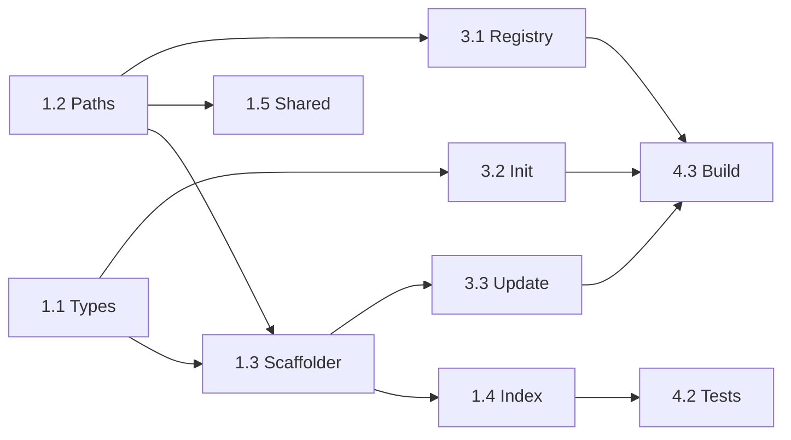

# Project Planning & Task Breakdown — Claude Code Support

> **Prerequisite**: Requirements and design docs completed and reviewed.

**Related docs**: [Requirements](../requirements/feature-claude-code-support.md) | [Design](../design/feature-claude-code-support.md) | [Implementation](../implementation/feature-claude-code-support.md) | [Testing](../testing/feature-claude-code-support.md)

## Milestones

| Milestone | Description | Exit criteria |
|-----------|-------------|---------------|
| M1 | Core scaffolder infrastructure | Types, paths, scaffolder module, index wiring all compile |
| M2 | Templates created | All `templates/claude-code/` and `templates/shared/CLAUDE.md` files exist |
| M3 | Commands updated | `init`, `update`, `list` all work with `claude-code` environment |
| M4 | Tests & polish | All tests pass, AGENTS.md updated, build succeeds |

## Task Breakdown

### Phase 1: Foundation (Infrastructure)

- [ ] Task 1.1: Update `src/types.ts` — Add `'claude-code'` to `Environment` union and `ENVIRONMENTS` array — Est: 5min — Depends on: none
- [ ] Task 1.2: Update `src/utils/paths.ts` — Add `claudeCodeTemplatesDir()` function — Est: 5min — Depends on: none
- [ ] Task 1.3: Create `src/scaffolders/claude-code.ts` — New scaffolder module with directory mapping and copy functions — Est: 15min — Depends on: 1.1, 1.2
- [ ] Task 1.4: Update `src/scaffolders/index.ts` — Add `claude-code` routing in `scaffoldComponent` and `removeComponentFiles` — Est: 10min — Depends on: 1.3
- [ ] Task 1.5: Update `src/scaffolders/shared.ts` — Add `CLAUDE.md` scaffolding alongside `AGENTS.md` — Est: 10min — Depends on: 1.2

### Phase 2: Templates

- [ ] Task 2.1: Create `templates/claude-code/skills/` — Convert all 16 skills with Claude Code path references — Est: 30min — Depends on: none
- [ ] Task 2.2: Create `templates/claude-code/commands/` — Convert all 15 commands with `name:` + `description:` frontmatter — Est: 20min — Depends on: none
- [ ] Task 2.3: Create `templates/claude-code/rules/` — Convert all 3 rules from `.mdc` to `.md` format — Est: 10min — Depends on: none
- [ ] Task 2.4: Create `templates/shared/CLAUDE.md` — Project memory template for Claude Code — Est: 10min — Depends on: none

### Phase 3: Commands & Registry

- [ ] Task 3.1: Update `src/registry/index.ts` — Add environment-aware scanning with `claudeCodeTemplatesDir()` — Est: 20min — Depends on: 1.2
- [ ] Task 3.2: Update `src/commands/init.ts` — Add 'Claude Code (.claude/)' label to environment selection — Est: 10min — Depends on: 1.1
- [ ] Task 3.3: Update `src/commands/update.ts` — Support claude-code target paths in `detectChanges` — Est: 15min — Depends on: 1.3
- [ ] Task 3.4: Update `src/index.ts` — Update CLI description to mention Claude Code — Est: 5min — Depends on: none

### Phase 4: Documentation & Tests

- [ ] Task 4.1: Update `templates/shared/AGENTS.md` — Add Claude Code directory references — Est: 5min — Depends on: none
- [ ] Task 4.2: Write unit tests for `claude-code.ts` scaffolder — Est: 20min — Depends on: 1.3
- [ ] Task 4.3: Verify build and all existing tests pass — Est: 10min — Depends on: all above

## Dependencies

Note: Phase 2 (templates) has no code dependencies and can be done in parallel with Phase 1.

## Timeline & Estimates

| Phase | Estimated effort | Notes |
|-------|-----------------|-------|
| Phase 1: Foundation | ~45 min | Infrastructure changes |
| Phase 2: Templates | ~70 min | Mostly file creation, can parallel with Phase 1 |
| Phase 3: Commands & Registry | ~50 min | Integration work |
| Phase 4: Tests & Polish | ~35 min | Verification |
| **Total** | **~3.5 hours** | |

## Risks & Mitigation

| Risk | Likelihood | Impact | Mitigation |
|------|-----------|--------|------------|
| Template content drift across environments | Medium | Medium | Accept for now; consider shared templates in future version |
| Registry refactor breaks existing behavior | Low | High | Thorough regression testing |
| Claude Code frontmatter format changes | Low | Low | Templates are easy to update |

## Definition of Done

### Functional
- [ ] All tasks checked off above
- [ ] `aidk init` with `claude-code` creates correct `.claude/` structure
- [ ] `aidk add/remove` works for claude-code components
- [ ] `aidk update` detects claude-code template changes
- [ ] `CLAUDE.md` generated alongside `AGENTS.md`

### Code Quality
- [ ] Functions are small (<50 lines)
- [ ] Files are focused (<800 lines)
- [ ] No hardcoded values
- [ ] Immutable patterns used

### Release
- [ ] All tests pass
- [ ] Build succeeds
- [ ] README updated if needed
