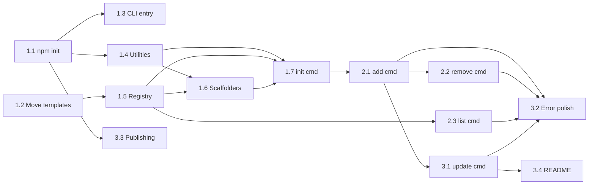

# Project Planning: CLI Tool (@anhvt2280/aidk)

**Related docs**: [Requirements](../requirements/feature-cli-tool.md) | [Design](../design/feature-cli-tool.md) | [Implementation](../implementation/feature-cli-tool.md) | [Testing](../testing/feature-cli-tool.md)

## Milestones

| Milestone | Description | Exit criteria |
|-----------|-------------|---------------|
| M1 | Project setup + `aidk init` working | Can `npx` the package and scaffold a project interactively |
| M2 | `aidk add` + `aidk remove` + `aidk list` working | Can manage individual components |
| M3 | `aidk update` + polish + publish | Update with confirmation works, published to GitHub Packages |

## Task Breakdown

### Phase 1: Foundation (M1)

- [x] Task 1.1: Initialize npm package — Est: 1h — Depends on: none
  - Create `package.json` with `@anhvt2280/aidk` name, `bin` field, `engines`, `publishConfig`
  - Create `tsconfig.json` for Node.js 24 target
  - Create `vitest.config.ts`
  - Set up `tsup` build config
  - Add `.gitignore` updates for `dist/`

- [x] Task 1.2: Move existing templates into `templates/` directory — Est: 1h — Depends on: none
  - Move `.cursor/commands/` → `templates/cursor/commands/`
  - Move `.cursor/rules/` → `templates/cursor/rules/`
  - Move `.cursor/skills/` → `templates/cursor/skills/`
  - Move `docs/ai/*/README.md` → `templates/docs/*/README.md`
  - Move `AGENTS.md` → `templates/shared/AGENTS.md`
  - Verify `.agent/` content maps from Cursor templates (no separate storage)

- [x] Task 1.3: Create CLI entry point and Commander setup — Est: 1h — Depends on: 1.1
  - `src/index.ts` with shebang, Commander program setup
  - Register all 5 commands (init, add, remove, list, update)
  - Verify `npx` invocation works locally with `npm link`

- [x] Task 1.4: Build utility modules — Est: 2h — Depends on: 1.1
  - `src/utils/config.ts` — read/write `.ai-devkit.json` with type safety
  - `src/utils/fs.ts` — safe copy, remove, diff helpers using fs-extra
  - `src/utils/prompts.ts` — reusable @clack/prompts wrappers

- [x] Task 1.5: Build component registry — Est: 1h — Depends on: 1.2
  - `src/registry/index.ts` — scan `templates/` at build time, export typed catalog
  - Map component names to template paths and descriptions

- [x] Task 1.6: Build IDE scaffolders — Est: 2h — Depends on: 1.4, 1.5
  - `src/scaffolders/cursor.ts` — copy to `.cursor/` with correct structure
  - `src/scaffolders/antigravity.ts` — copy to `.agent/` with `.mdc` → `.md` conversion
  - `src/scaffolders/shared.ts` — copy `docs/ai/`, `AGENTS.md`, generate `.ai-devkit.json`

- [x] Task 1.7: Implement `aidk init` command — Est: 3h — Depends on: 1.4, 1.5, 1.6
  - IDE selection prompt (Cursor, Antigravity, or both)
  - Doc phase selection prompt (multiselect with defaults)
  - Skill selection prompt (all, select individually, none)
  - Orchestrate scaffolders based on selections
  - Write `.ai-devkit.json` with installed state
  - Handle existing project detection (warn/offer re-init)

### Phase 2: Component Management (M2)

- [x] Task 2.1: Implement `aidk add` command — Est: 2h — Depends on: 1.7
  - Parse `<type>` and `<name>` arguments
  - Validate component exists in registry
  - Check `.ai-devkit.json` for configured environments
  - Copy to all configured IDE directories
  - Update `.ai-devkit.json`
  - Handle already-installed case (warn and skip)
  - Handle missing config case (prompt to run `init`)

- [x] Task 2.2: Implement `aidk remove` command — Est: 1.5h — Depends on: 2.1
  - Validate component is installed (check `.ai-devkit.json`)
  - Confirm removal with user
  - Delete files from all configured IDE directories
  - Update `.ai-devkit.json`
  - Handle not-installed case (warn gracefully)

- [x] Task 2.3: Implement `aidk list` command — Est: 1h — Depends on: 1.5
  - Optional `[type]` filter argument
  - Read `.ai-devkit.json` for installed state
  - Cross-reference with registry for available state
  - Format output with checkmarks (installed vs not)

### Phase 3: Update & Polish (M3)

- [x] Task 3.1: Implement `aidk update` command — Est: 3h — Depends on: 2.1
  - Compare bundled template versions with installed files
  - Detect modified, new, and unchanged files
  - Display change summary (modified, new)
  - Prompt: "Yes update all" / "Select files individually" / "Cancel"
  - For individual selection: multiselect of changed files
  - Apply selected updates, skip unselected
  - Update `.ai-devkit.json` version fields

- [x] Task 3.2: Error handling polish — Est: 1h — Depends on: 2.1, 2.2, 2.3, 3.1
  - Consistent error message format across all commands
  - Graceful handling of filesystem errors (permissions, disk full)
  - Non-zero exit codes for errors
  - User cancellation handling (exit code 2)

- [x] Task 3.3: GitHub Packages publishing setup — Est: 1h — Depends on: 1.1
  - Create `.github/workflows/publish.yml` for automated publishing
  - Configure `.npmrc` for GitHub Packages authentication
  - Document installation instructions in README

- [x] Task 3.4: Write README.md — Est: 1h — Depends on: 3.1
  - Installation instructions (GitHub Packages setup)
  - Usage examples for all 5 commands
  - Configuration reference (`.ai-devkit.json`)
  - Contributing guide

## Dependencies

## Timeline & Estimates

| Phase | Estimated effort | Description |
|-------|-----------------|-------------|
| Phase 1: Foundation | ~11h | Package setup, templates, utilities, scaffolders, `init` command |
| Phase 2: Component Management | ~4.5h | `add`, `remove`, `list` commands |
| Phase 3: Update & Polish | ~6h | `update` command, error handling, publishing, README |
| **Total** | **~21.5h** | |

## Risks & Mitigation

| Risk | Likelihood | Impact | Mitigation |
|------|-----------|--------|------------|
| `.mdc` → `.md` conversion loses metadata | Low | Medium | Investigate `.mdc` format early; test with all existing rules |
| Template drift after moving to `templates/` | Medium | Low | Dogfood: use own CLI to scaffold this project's config |
| GitHub Packages auth friction for users | Medium | Medium | Provide clear `.npmrc` setup instructions in README |
| @clack/prompts API changes | Low | Low | Pin dependency version |

## Definition of Done

### Functional
- [ ] All 5 commands work correctly (init, add, remove, list, update)
- [ ] Both Cursor and Antigravity scaffolding produce correct structures
- [ ] `.ai-devkit.json` accurately tracks all installed components
- [ ] `update` command never overwrites without user confirmation
- [ ] All edge cases from requirements handled with clear error messages

### Code Quality (from `3-coding-style` rule)
- [ ] Functions < 50 lines
- [ ] Files < 800 lines (target 200-400)
- [ ] No deep nesting (> 4 levels)
- [ ] Proper error handling
- [ ] No hardcoded values
- [ ] Immutable patterns used

### Release
- [ ] Published to GitHub Packages
- [ ] README with installation and usage docs
- [ ] Tests passing with coverage targets
