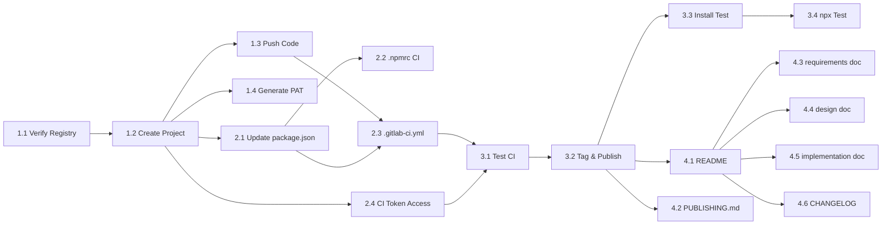

# Planning: GitHub → GitLab Migration

**Related docs**: [Requirements](../requirements/feature-github-to-gitlab.md) | [Design](../design/feature-github-to-gitlab.md) | [Implementation](../implementation/feature-github-to-gitlab.md) | [Testing](../testing/feature-github-to-gitlab.md)

## Milestones

| Milestone | Description | Exit criteria |
|-----------|-------------|---------------|
| M1 — Repo Live | GitLab project created, code pushed, CI running | `git clone git.caerux.com/caeruxlab/clx-ai-kit` succeeds; GitLab CI pipeline runs on push |
| M2 — Package Published | Package published to GitLab Package Registry with new scope | `npm install @caeruxlab/aidk` succeeds with `.npmrc` configured |
| M3 — Docs Complete | README, PUBLISHING.md, and all feature docs updated | No `npm.pkg.github.com` or `github.com/anhvt2280` references remain in docs |

## Task Breakdown

### Phase 1: GitLab Project Setup

- [ ] **1.1** — Verify GitLab Package Registry is enabled on `git.caerux.com` — Est: 15min — Depends on: none
- [ ] **1.2** — Create GitLab project `caeruxlab/clx-ai-kit` (private) — Est: 10min — Depends on: 1.1
- [x] **1.3** — Add GitLab remote and push existing code (`feat/gitlab-migration` branch) — Est: 15min — Depends on: 1.2
  ```bash
  git remote add gitlab https://git.caerux.com/caeruxlab/clx-ai-kit.git
  git push gitlab main --follow-tags
  ```
- [x] **1.4** — Generate a GitLab Personal Access Token with `write_package_registry` and `read_package_registry` scopes — Est: 5min — Depends on: 1.2

### Phase 2: Package Configuration

- [x] **2.1** — Update `package.json`: scope → `@caeruxlab`, `publishConfig.registry`, `repository.url` — Est: 10min — Depends on: 1.2
- [x] **2.2** — Add `.npmrc` (project-level) pointing to GitLab registry for CI use — Est: 10min — Depends on: 2.1
- [x] **2.3** — Write `.gitlab-ci.yml` with `test` and `publish` stages — Est: 30min — Depends on: 1.3, 2.1
- [ ] **2.4** — Verify CI Job Token has Package Registry write access in GitLab project settings — Est: 10min — Depends on: 1.2

### Phase 3: CI/CD Validation

- [x] **3.1** — Push a commit and verify `test` stage passes — Est: 15min — Depends on: 2.3
- [x] **3.2** — Push a `v0.2.0` tag and verify `publish` stage publishes and the package appears in GitLab Package Registry — Est: 20min — Depends on: 3.1
- [x] **3.3** — Test `npm install @caeruxlab/aidk` in a fresh directory with `.npmrc` configured — Est: 15min — Depends on: 3.2
- [x] **3.4** — Test `npx @caeruxlab/aidk --version` returns the correct version — Est: 5min — Depends on: 3.3

### Phase 4: Documentation Update

- [x] **4.1** — Rewrite `README.md` install section (scope, registry URL, token setup) — Est: 20min — Depends on: 3.2
- [x] **4.2** — Rewrite `PUBLISHING.md` for GitLab workflow (PAT, `.npmrc`, tag push, pipeline monitoring, troubleshooting) — Est: 45min — Depends on: 3.2
- [x] **4.3** — Update `docs/ai/requirements/feature-cli-tool.md` — replace GitHub Packages references — Est: 15min — Depends on: 4.1
- [x] **4.4** — Update `docs/ai/design/feature-cli-tool.md` — Decision #3 and Security Design section — Est: 15min — Depends on: 4.1
- [x] **4.5** — Update `docs/ai/implementation/feature-cli-tool.md` — clone URL, publish steps — Est: 10min — Depends on: 4.1
- [x] **4.6** — Update `CHANGELOG.md` with migration entry — Est: 10min — Depends on: 4.1

## Dependencies



## Timeline & Estimates

| Phase | Estimated effort | Notes |
|-------|-----------------|-------|
| Phase 1: Project Setup | ~45min | Blocked on GitLab access verification |
| Phase 2: Package Config | ~1h | Mechanical; low risk |
| Phase 3: CI/CD Validation | ~1h | Requires tag push + pipeline run |
| Phase 4: Documentation | ~2h | Most time-consuming but zero risk |
| **Total** | **~4.5h** | Single session realistic |

## Risks & Mitigation

| Risk | Likelihood | Impact | Mitigation | Owner |
|------|-----------|--------|------------|-------|
| GitLab Package Registry not enabled on instance | Medium | High | Verify in step 1.1 before any other work; unblocks entire migration | Maintainer |
| CI Job Token lacks `write_package_registry` permission | Low | High | Verify in step 2.4; fallback: use PAT stored as CI variable `NPM_TOKEN` | Maintainer |
| `@caeruxlab` scope conflicts with existing GitLab group packages | Low | Low | Check group package registry before publishing | Maintainer |
| Consumers using old `@anhvt2280` scope break | Low | Low | Sole user is the maintainer; add deprecation notice to old README if needed | Maintainer |

## Resources Needed

- **People**: Maintainer only (`@anhvt2280`)
- **Tools**: GitLab instance access (admin or owner role on `caeruxlab` group), Git, Node.js >= 24, npm
- **Secrets**: GitLab PAT with `write_package_registry` + `read_package_registry` (for local testing/manual publish)
- **Knowledge**: [GitLab npm registry docs](https://docs.gitlab.com/ee/user/packages/npm_registry/)

## Definition of Done

### Functional
- [ ] All tasks above checked off
- [ ] Package live in GitLab registry and installable
- [ ] CI pipeline publishes on tag push end-to-end

### Code Quality
- [ ] No hardcoded tokens anywhere in repo
- [ ] `.npmrc` in project root uses only CI environment variables (no real tokens)
- [ ] All updated Markdown is readable and consistent

### Release
- [ ] Feature branch merged to main via MR (or direct push with MR description)
- [ ] CHANGELOG updated
- [ ] Version bumped to `0.2.0` (minor bump — scope change is a breaking change for prior consumers)
