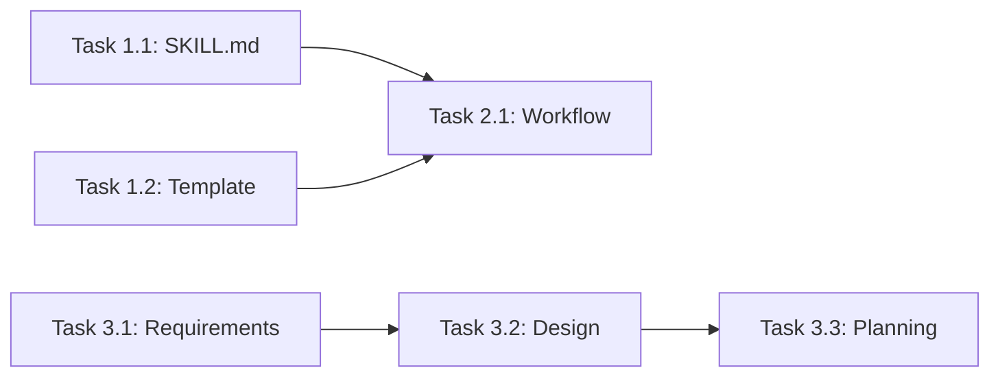

# Planning: PA/DA Report Generator (`report-po`)

> **Status**: ✅ Complete
>
> **Related docs**: [Requirements](../requirements/feature-report-po.md) | [Design](../design/feature-report-po.md) | [Implementation](../implementation/feature-report-po.md) | [Testing](../testing/feature-report-po.md)

## Milestones

| Milestone | Description | Target date | Exit criteria |
|-----------|-------------|-------------|---------------|
| M1 | Skill and template created | 2026-02-24 | SKILL.md + report-template.md exist with complete content |
| M2 | Workflow created | 2026-02-24 | create-report-po.md exists with all 12 steps |
| M3 | Feature documentation | 2026-02-24 | Requirements, design, planning docs complete |

## Task Breakdown

### Phase 1: Foundation
- [x] Task 1.1: Create `SKILL.md` with PA/DA methodology — Est: 1h — Depends on: none
- [x] Task 1.2: Create `templates/report-template.md` with Vietnamese structure — Est: 30m — Depends on: none

### Phase 2: Workflow
- [x] Task 2.1: Create `create-report-po.md` workflow — Est: 30m — Depends on: 1.1, 1.2

### Phase 3: Documentation
- [x] Task 3.1: Create requirements doc — Est: 30m — Depends on: none
- [x] Task 3.2: Create design doc with decision log — Est: 30m — Depends on: 3.1
- [x] Task 3.3: Create planning doc — Est: 15m — Depends on: 3.2

## Dependencies

## Timeline & Estimates

| Phase | Estimated effort | Start | End | Buffer |
|-------|-----------------|-------|-----|--------|
| Phase 1 | 1.5h | 2026-02-24 | 2026-02-24 | N/A |
| Phase 2 | 30m | 2026-02-24 | 2026-02-24 | N/A |
| Phase 3 | 1h 15m | 2026-02-24 | 2026-02-24 | N/A |

## Risks & Mitigation

| Risk | Likelihood | Impact | Mitigation | Owner |
|------|-----------|--------|------------|-------|
| Notion MCP not available | Low | Med | Fallback to local .md file | User |
| Template doesn't fit all cases | Med | Low | Template can be extended as needed | Team |

## Definition of Done

### Functional
- [x] All tasks checked off above
- [x] SKILL.md created with complete PA/DA methodology
- [x] report-template.md created with Vietnamese structure
- [x] create-report-po.md workflow created with all steps
- [x] Feature documentation complete

### Code Quality
- [x] Files are focused (<800 lines)
- [x] No hardcoded values (template uses placeholders)
- [x] Clear, readable content in Vietnamese

### Release
- [x] Files committed to repository
