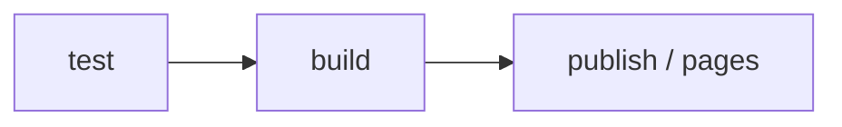

# Cấu hình GitLab

## Tổng quan pipeline

AIDK sử dụng GitLab CI/CD với 3 stage chính:



| Stage | Mô tả |
|-------|-------|
| `test` | Chạy unit tests và type checks |
| `build` | Build package CLI (`dist/`) |
| `publish` | Xuất bản lên GitLab Package Registry (khi tag mới) |
| `pages` | Build và deploy trang tài liệu Docusaurus lên GitLab Pages |

## File `.gitlab-ci.yml`

```yaml
stages:
  - test
  - build
  - publish
  - pages

variables:
  NODE_VERSION: "24"

default:
  image: node:${NODE_VERSION}
  cache:
    paths:
      - node_modules/
      - website/node_modules/

# ── TEST ──────────────────────────────────────────────────────────────
test:
  stage: test
  script:
    - npm ci
    - npm run lint
    - npm test

# ── BUILD ─────────────────────────────────────────────────────────────
build:
  stage: build
  script:
    - npm ci
    - npm run build
  artifacts:
    paths:
      - dist/
    expire_in: 1 hour

# ── PUBLISH ───────────────────────────────────────────────────────────
publish:
  stage: publish
  script:
    - npm ci
    - npm run build
    - npm publish
  rules:
    - if: $CI_COMMIT_TAG

# ── PAGES (Docusaurus) ────────────────────────────────────────────────
pages:
  stage: pages
  script:
    - cd website
    - npm ci
    - npm run build
    - mv build ../public
  artifacts:
    paths:
      - public
  rules:
    - if: $CI_COMMIT_BRANCH == "main"
```

## Cấu hình biến môi trường trong GitLab

Vào **Project → Settings → CI/CD → Variables** và thêm:

| Biến | Mô tả | Protected | Masked |
|------|-------|-----------|--------|
| `NPM_TOKEN` | Personal Access Token với scope `api` hoặc `write_registry` | ✅ | ✅ |

## Cấu hình GitLab Pages

GitLab Pages tự động được kích hoạt khi job `pages` chạy thành công và tạo ra artifact `public/`.

**URL mặc định:**
```
https://<namespace>.gitlab.io/<project-name>/
```

Ví dụ: `https://caeruxlab.gitlab.io/clx-ai-kit/`

:::info
Nếu bạn dùng self-managed GitLab, URL sẽ khác. Kiểm tra trong **Project → Pages** sau khi pipeline chạy thành công lần đầu.
:::

## Cấu hình Package Registry

Package Registry được bật mặc định cho mọi project GitLab. Sau khi publish thành công, package sẽ hiển thị tại:

**Project → Deploy → Package Registry**

Người dùng muốn cài đặt package cần thêm vào `.npmrc` của họ:

```ini
@caeruxlab:registry=https://git.caerux.com/api/v4/projects/<project-id>/packages/npm/
//git.caerux.com/api/v4/projects/<project-id>/packages/npm/:_authToken=<their-token>
```

## Tag-based Release (Xuất bản theo tag)

Để phát hành version mới:

```bash
# 1. Cập nhật version trong package.json
npm version minor   # hoặc patch / major

# 2. Push tag lên GitLab
git push origin main --tags
```

GitLab CI sẽ tự động trigger job `publish` khi phát hiện tag mới.
