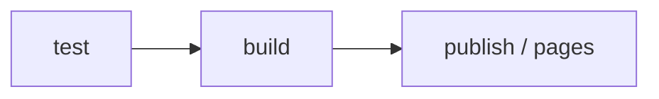

# GitLab Setup

## Pipeline Overview

AIDK uses GitLab CI/CD with 3 main stages:



| Stage | Description |
|-------|-------------|
| `test` | Run unit tests and type checks |
| `build` | Build the CLI package (`dist/`) |
| `publish` | Publish to GitLab Package Registry (on new tags) |
| `pages` | Build and deploy the Docusaurus site to GitLab Pages |

## `.gitlab-ci.yml` Configuration

```yaml
stages:
  - test
  - build
  - publish
  - pages

variables:
  NODE_VERSION: "24"

default:
  image: node:${NODE_VERSION}
  cache:
    paths:
      - node_modules/
      - website/node_modules/

# ── TEST ──────────────────────────────────────────────────────────────
test:
  stage: test
  script:
    - npm ci
    - npm run lint
    - npm test

# ── BUILD ─────────────────────────────────────────────────────────────
build:
  stage: build
  script:
    - npm ci
    - npm run build
  artifacts:
    paths:
      - dist/
    expire_in: 1 hour

# ── PUBLISH ───────────────────────────────────────────────────────────
publish:
  stage: publish
  script:
    - npm ci
    - npm run build
    - npm publish
  rules:
    - if: $CI_COMMIT_TAG

# ── PAGES (Docusaurus) ────────────────────────────────────────────────
pages:
  stage: pages
  script:
    - cd website
    - npm ci
    - npm run build
    - mv build ../public
  artifacts:
    paths:
      - public
  rules:
    - if: $CI_COMMIT_BRANCH == "main"
```

## Setting Environment Variables in GitLab

Go to **Project → Settings → CI/CD → Variables** and add:

| Variable | Description | Protected | Masked |
|----------|-------------|-----------|--------|
| `NPM_TOKEN` | Personal Access Token with `api` or `write_registry` scope | ✅ | ✅ |

## GitLab Pages Configuration

GitLab Pages is automatically activated when the `pages` job runs successfully and produces a `public/` artifact.

**Default URL:**
```
https://<namespace>.gitlab.io/<project-name>/
```

Example: `https://caeruxlab.gitlab.io/clx-ai-kit/`

:::info
If you use a self-managed GitLab instance, the URL will differ. Check **Project → Pages** after the first successful pipeline run.
:::

## Package Registry

Package Registry is enabled by default for all GitLab projects. After a successful publish, the package will appear at:

**Project → Deploy → Package Registry**

Users who want to install the package need to add the following to their `.npmrc`:

```ini
@caeruxlab:registry=https://git.caerux.com/api/v4/projects/<project-id>/packages/npm/
//git.caerux.com/api/v4/projects/<project-id>/packages/npm/:_authToken=<their-token>
```

## Tag-based Releases

To release a new version:

```bash
# 1. Bump the version in package.json
npm version minor   # or patch / major

# 2. Push the tag to GitLab
git push origin main --tags
```

GitLab CI will automatically trigger the `publish` job when a new tag is detected.
