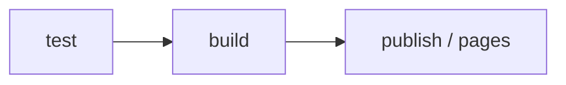

# GitLabセットアップ

## パイプラインの概要

AIDKは3つの主要なステージでGitLab CI/CDを使用します：



| ステージ | 説明 |
|---------|------|
| `test` | ユニットテストと型チェックを実行 |
| `build` | CLIパッケージ（`dist/`）をビルド |
| `publish` | GitLab Package Registryに公開（新しいタグ時） |
| `pages` | DocusaurusサイトをビルドしてGitLab Pagesにデプロイ |

## `.gitlab-ci.yml` 設定

```yaml
stages:
  - test
  - build
  - publish
  - pages

variables:
  NODE_VERSION: "24"

default:
  image: node:${NODE_VERSION}
  cache:
    paths:
      - node_modules/
      - website/node_modules/

# ── TEST ──────────────────────────────────────────────────────────────
test:
  stage: test
  script:
    - npm ci
    - npm run lint
    - npm test

# ── BUILD ─────────────────────────────────────────────────────────────
build:
  stage: build
  script:
    - npm ci
    - npm run build
  artifacts:
    paths:
      - dist/
    expire_in: 1 hour

# ── PUBLISH ───────────────────────────────────────────────────────────
publish:
  stage: publish
  script:
    - npm ci
    - npm run build
    - npm publish
  rules:
    - if: $CI_COMMIT_TAG

# ── PAGES (Docusaurus) ────────────────────────────────────────────────
pages:
  stage: pages
  script:
    - cd website
    - npm ci
    - npm run build
    - mv build ../public
  artifacts:
    paths:
      - public
  rules:
    - if: $CI_COMMIT_BRANCH == "main"
```

## GitLabでの環境変数設定

**Project → Settings → CI/CD → Variables** に移動して追加します：

| 変数 | 説明 | Protected | Masked |
|-----|------|-----------|--------|
| `NPM_TOKEN` | `api` または `write_registry` スコープを持つPersonal Access Token | ✅ | ✅ |

## GitLab Pagesの設定

GitLab Pagesは、`pages` ジョブが正常に実行されて `public/` アーティファクトが生成されると自動的に有効になります。

**デフォルトURL：**
```
https://<namespace>.gitlab.io/<project-name>/
```

例：`https://caeruxlab.gitlab.io/clx-ai-kit/`

:::info
セルフマネージドのGitLabインスタンスを使用している場合、URLが異なります。最初のパイプラインが正常に実行された後、**Project → Pages** で確認してください。
:::

## Package Registryの設定

Package Registryはすべてのプロジェクトでデフォルトで有効になっています。公開が成功すると、パッケージは以下に表示されます：

**Project → Deploy → Package Registry**

パッケージをインストールしたいユーザーは `.npmrc` に以下を追加する必要があります：

```ini
@caeruxlab:registry=https://git.caerux.com/api/v4/projects/<project-id>/packages/npm/
//git.caerux.com/api/v4/projects/<project-id>/packages/npm/:_authToken=<their-token>
```

## タグベースのリリース

新しいバージョンをリリースするには：

```bash
# 1. package.json のバージョンを更新
npm version minor   # または patch / major

# 2. GitLabにタグをプッシュ
git push origin main --tags
```

新しいタグが検出されると、GitLab CIは自動的に `publish` ジョブをトリガーします。
